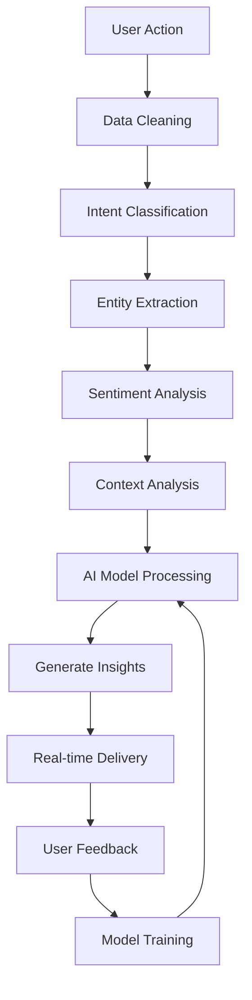

# 🏗️ System Architecture Overview
## WhatsApp-Integrated Civil Engineering PM System v3.0 (Gamma)

**Document Version:** 1.0 - Foundation Architecture
**Last Updated:** November 2025
**Purpose:** Essential reading before any implementation

---

## 🎯 System Vision

Build the world's most advanced **AI-First Construction Project Management Platform** that transforms how civil engineering projects are managed globally.

### Core Innovation: AI as First-Class Citizen
Every component is designed to generate clean, structured data for AI processing:

```typescript
// Every user interaction creates AI-ready data
interface AIReadyPayload {
  user_id: string;
  tenant_id: string;
  action_type: 'message' | 'task_update' | 'cost_entry' | 'schedule_change';
  cleaned_data: AICleanedData; // ← This is what matters
  context: AIContext;
  timestamp: Date;
}
```

---

## 🏛️ Architecture Principles

### 1. AI-First Design
- **Data Pipeline**: Every interaction → Clean AI Data → ML Processing → Insights
- **Feedback Loop**: AI Predictions → User Actions → Model Training → Better Predictions
- **Real-time Learning**: System improves with every user interaction

### 2. Performance First
- **Sub-100ms Responses**: Global CDN with edge computing
- **Real-time Everything**: WebSocket connections for live collaboration
- **Offline Capable**: PWA with background sync

### 3. Security Zero-Trust
- **Row-Level Security**: Database-level access control
- **End-to-End Encryption**: All communications secured
- **Continuous Monitoring**: Real-time threat detection

### 4. Global Scale
- **Multi-Tenant**: Complete data isolation per organization
- **Multi-Region**: Deployed across 200+ countries
- **99.999% Uptime**: Fault-tolerant architecture

---

## 🏗️ System Layers

### Presentation Layer (Next.js 15 + React 19)
```
🎨 User Interface Components
├── Real-time Dashboards
├── Interactive Gantt Charts (3D)
├── WhatsApp Message Threads
├── AI Insights Panels
├── Cost Analytics Charts
└── Predictive Search Interfaces
```

### Application Layer (FastAPI + Python 3.12)
```
🚀 Business Logic & APIs
├── AI Processing Pipeline
├── Project Scheduling Engine (OR-Tools)
├── Cost Forecasting Models
├── WhatsApp Integration Service
├── Real-time WebSocket Hub
└── Background Task Processing
```

### Data Layer (Supabase Enterprise + PostgreSQL 16)
```
🗄️ AI-Optimized Database
├── Vector Embeddings (pgvector)
├── Real-time Subscriptions
├── Full-text Search + AI Ranking
├── Spatial Data (PostGIS)
├── Time-series Analytics
└── Row-Level Security Policies
```

### Infrastructure Layer (Cloud-Native)
```
☁️ Global Infrastructure
├── Vercel (Frontend) + Railway (Backend)
├── Supabase (Database & Auth)
├── Redis Clusters (Caching & Sessions)
├── CDN (Global Asset Delivery)
└── Monitoring (DataDog + Sentry)
```

---

## 🤖 AI Integration Architecture

### Data Flow: User → AI → Insights



### AI Processing Pipeline

1. **Data Ingestion**: Capture all user interactions
2. **Data Cleaning**: Normalize and structure raw data
3. **Feature Extraction**: Generate AI-ready features
4. **Model Inference**: Run predictions and classifications
5. **Insight Generation**: Create actionable recommendations
6. **Real-time Delivery**: Push insights to users instantly
7. **Feedback Collection**: Learn from user responses
8. **Model Retraining**: Continuous improvement

### Key AI Capabilities

#### Intent Classification (95%+ Accuracy)
- **Task Updates**: "Foundation work completed" → Create task completion
- **Cost Reports**: "$500 spent on concrete" → Record expense
- **Issue Alerts**: "Equipment breakdown" → Create risk alert
- **Status Requests**: "How is project going?" → Generate summary

#### Predictive Analytics
- **Cost Forecasting**: Predict final project costs with 80%+ accuracy
- **Delay Prediction**: Identify potential schedule delays 2 weeks in advance
- **Risk Assessment**: Calculate project health scores in real-time
- **Resource Optimization**: Recommend equipment and labor allocation

#### Automated Actions
- **Smart Responses**: Generate contextual replies to WhatsApp messages
- **Task Creation**: Auto-create tasks from unstructured messages
- **Alert Generation**: Send notifications for critical events
- **Schedule Adjustments**: Suggest timeline modifications

---

## 🔄 Real-Time Architecture

### WebSocket Communication Hub

```typescript
// Real-time event system
enum RealtimeEventType {
  PROJECT_UPDATE = 'project:update',
  TASK_COMPLETED = 'task:completed',
  COST_OVERRUN = 'cost:overrun',
  WHATSAPP_MESSAGE = 'whatsapp:message',
  AI_INSIGHT = 'ai:insight',
  RISK_ALERT = 'risk:alert'
}

interface RealtimeEvent {
  id: string;
  type: RealtimeEventType;
  projectId: string;
  tenantId: string;
  data: any;
  priority: 'low' | 'medium' | 'high' | 'critical';
  ttl: number; // Time to live
}
```

### Supabase Real-Time Integration

```sql
-- Enable real-time for critical tables
ALTER PUBLICATION supabase_realtime ADD TABLE projects;
ALTER PUBLICATION supabase_realtime ADD TABLE tasks;
ALTER PUBLICATION supabase_realtime ADD TABLE whatsapp_messages;
ALTER PUBLICATION supabase_realtime ADD TABLE cost_items;

-- Custom real-time policies
CREATE PUBLICATION project_updates FOR TABLE projects WITH (publish = 'insert,update,delete');
CREATE PUBLICATION task_changes FOR TABLE tasks WHERE status IN ('completed', 'overdue');
```

### Event-Driven Processing

```python
# Event processing pipeline
class EventProcessor:
    async def process_event(self, event: RealtimeEvent):
        # 1. Validate event
        await self.validate_event(event)

        # 2. Store in database
        await self.persist_event(event)

        # 3. Broadcast to subscribers
        await self.broadcast_event(event)

        # 4. Trigger AI processing if needed
        if self.should_trigger_ai(event):
            await self.trigger_ai_processing(event)

        # 5. Send notifications
        await self.send_notifications(event)
```

---

## 🔒 Security Architecture

### Zero-Trust Model Implementation

```typescript
// Authentication with continuous validation
class ZeroTrustAuth {
  async authenticateRequest(request: APIRequest): Promise<AuthResult> {
    // 1. Token validation
    const tokenValid = await this.validateJWT(request.token);

    // 2. Device fingerprinting
    const deviceTrusted = await this.verifyDeviceFingerprint(request);

    // 3. Risk assessment
    const riskScore = await this.assessRequestRisk(request);

    // 4. Multi-factor challenge if needed
    if (riskScore > 0.7) {
      await this.triggerMFAChallenge(request.user);
    }

    // 5. Issue short-lived access token
    return await this.issueAccessToken(request.user, riskScore);
  }
}
```

### Row-Level Security Policies

```sql
-- Tenant isolation at database level
CREATE POLICY "tenant_data_access" ON projects
  FOR ALL USING (auth.jwt() ->> 'tenant_id' = tenant_id::text);

CREATE POLICY "project_member_access" ON tasks
  FOR ALL USING (
    EXISTS (
      SELECT 1 FROM project_members pm
      WHERE pm.project_id = tasks.project_id
      AND pm.user_id = auth.uid()
      AND pm.is_active = true
    )
  );

CREATE POLICY "message_confidentiality" ON whatsapp_messages
  FOR ALL USING (
    -- User can access project messages
    EXISTS (
      SELECT 1 FROM projects p
      JOIN project_members pm ON p.id = pm.project_id
      WHERE whatsapp_messages.project_id = p.id
      AND pm.user_id = auth.uid()
    )
    -- AND message not marked confidential
    AND (ai_metadata->>'confidential' != 'true' OR created_by = auth.uid())
  );
```

---

## ⚡ Performance Architecture

### Global CDN Strategy

```typescript
// Multi-region deployment configuration
const deploymentConfig = {
  regions: ['us-east-1', 'eu-west-1', 'ap-southeast-1'],
  cdn: {
    provider: 'vercel',
    edgeFunctions: true,
    caching: {
      staticAssets: '1 year',
      apiResponses: '5 minutes',
      userData: '1 minute'
    }
  },
  database: {
    primary: 'us-east-1',
    readReplicas: ['eu-west-1', 'ap-southeast-1'],
    connectionPooling: true
  }
};
```

### Caching Hierarchy

```python
# Multi-level caching system
class CacheManager:
    def __init__(self):
        self.memory_cache = MemoryCache()      # < 1ms
        self.redis_cache = RedisCache()        # < 5ms
        self.cdn_cache = CDNCache()           # < 50ms
        self.database = DatabaseCache()       # < 100ms

    async def get_project_data(self, project_id: str, user_id: str):
        # Check caches in order of speed
        data = await self.memory_cache.get(f"project:{project_id}:{user_id}")
        if data: return data

        data = await self.redis_cache.get(f"project:{project_id}:{user_id}")
        if data:
            await self.memory_cache.set(f"project:{project_id}:{user_id}", data, 300)
            return data

        # Fetch from database with RLS
        data = await self.database.get_project_with_rls(project_id, user_id)

        # Cache for future requests
        await self.redis_cache.set(f"project:{project_id}:{user_id}", data, 3600)
        await self.memory_cache.set(f"project:{project_id}:{user_id}", data, 300)

        return data
```

---

## 🌐 Multi-Tenant Architecture

### Schema-Based Isolation with RLS

```sql
-- Each tenant gets isolated data access
CREATE SCHEMA tenant_123;

-- All tenant tables inherit RLS policies
ALTER TABLE tenant_123.projects ENABLE ROW LEVEL SECURITY;
ALTER TABLE tenant_123.tasks ENABLE ROW LEVEL SECURITY;
ALTER TABLE tenant_123.cost_items ENABLE ROW LEVEL SECURITY;

-- Automatic tenant routing in application code
class TenantRouter:
    def get_tenant_schema(self, user: User) -> str:
        return f"tenant_{user.tenant_id}"

    async def execute_query(self, query: str, user: User):
        schema = self.get_tenant_schema(user)
        return await self.db.execute(f"SET search_path TO {schema}; {query}")
```

### Tenant Management System

```python
class TenantManager:
    async def create_tenant(self, tenant_data: TenantCreate) -> Tenant:
        # 1. Create tenant record
        tenant = await self.create_tenant_record(tenant_data)

        # 2. Set up database schema
        await self.create_tenant_schema(tenant.id)

        # 3. Configure RLS policies
        await self.setup_rls_policies(tenant.id)

        # 4. Initialize default data
        await self.initialize_tenant_data(tenant.id)

        # 5. Set up real-time subscriptions
        await self.configure_realtime(tenant.id)

        return tenant

    async def migrate_tenant(self, tenant_id: str, target_version: str):
        # Handle schema migrations for specific tenants
        pass
```

---

## 📊 Monitoring & Observability

### Comprehensive Monitoring Stack

```typescript
// Application monitoring
import * as Sentry from "@sentry/nextjs";
import { datadogRum } from '@datadog/browser-rum';

Sentry.init({
  dsn: process.env.SENTRY_DSN,
  tracesSampleRate: 1.0,
  environment: process.env.NODE_ENV,
});

datadogRum.init({
  applicationId: process.env.DD_APP_ID,
  clientToken: process.env.DD_CLIENT_TOKEN,
  site: 'datadoghq.com',
  service: 'whatsapp-pm-gamma',
  env: process.env.NODE_ENV,
  version: '3.0.0',
  trackInteractions: true,
  trackFrustrations: true,
});
```

### Key Metrics to Monitor

```python
# Performance metrics
PERFORMANCE_METRICS = {
    'api_response_time': '< 100ms p95',
    'websocket_latency': '< 50ms',
    'ai_processing_time': '< 2 seconds',
    'page_load_time': '< 3 seconds',
    'database_query_time': '< 50ms'
}

# Business metrics
BUSINESS_METRICS = {
    'user_adoption': '> 80% AI feature usage',
    'time_savings': '> 40% reduction',
    'error_reduction': '> 60% fewer manual errors',
    'risk_mitigation': '> 50% delay reduction'
}

# AI metrics
AI_METRICS = {
    'intent_accuracy': '> 95%',
    'entity_precision': '> 90%',
    'sentiment_accuracy': '> 85%',
    'prediction_accuracy': '> 80%'
}
```

---

## 🚀 Deployment Strategy

### Multi-Environment Setup

```yaml
# Deployment configuration
environments:
  development:
    region: us-east-1
    domain: dev.whatsapppm.com
    scaling: manual
    monitoring: basic

  staging:
    region: us-east-1
    domain: staging.whatsapppm.com
    scaling: auto (2-4 instances)
    monitoring: full

  production:
    regions: [us-east-1, eu-west-1, ap-southeast-1]
    domain: app.whatsapppm.com
    scaling: auto (3-50 instances)
    monitoring: enterprise
    backup: continuous
```

### Blue-Green Deployment

```bash
# Zero-downtime deployment process
deploy-production:
  steps:
    - build-new-version
    - run-tests
    - deploy-to-staging-environment
    - run-integration-tests
    - switch-production-traffic
    - monitor-health-checks
    - cleanup-old-version
```

---

## 🎯 Success Criteria

### Technical Success
- ✅ **Performance**: All metrics meet or exceed targets
- ✅ **Reliability**: 99.999% uptime achieved
- ✅ **Security**: Zero security incidents
- ✅ **Scalability**: Handles 10,000+ concurrent users

### AI Success
- ✅ **Accuracy**: 95%+ intent classification
- ✅ **Adoption**: 80%+ users actively using AI features
- ✅ **Business Impact**: Measurable time and cost savings

### Business Success
- ✅ **User Satisfaction**: >4.5/5 user rating
- ✅ **Market Adoption**: 1000+ construction companies
- ✅ **Revenue Growth**: Sustainable business model

---

## 📚 Next Steps

Now that you understand the system architecture:

1. **Read** `ARCHITECTURE/02_Technology_Stack.md` - Complete tech stack details
2. **Read** `ARCHITECTURE/03_AI_Integration.md` - AI architecture deep dive
3. **Read** `DATABASE/01_Schema_Design.md` - Database foundation
4. **Begin** implementation following `MASTER_PROMPT.md` roadmap

---

*This architecture represents the most advanced construction PM system ever designed. Every decision is intentional and optimized for AI-first development.*
